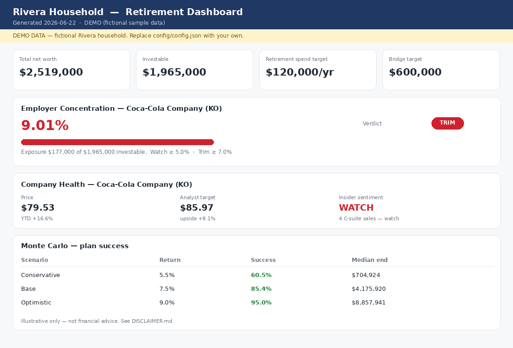

# Retirement Planning Toolkit


A config-driven, self-managed retirement planning kit: a multi-tab spreadsheet
model, a Monte Carlo engine, an HTML dashboard, and a **company-health monitor**
that tracks your employer's stock to inform RSU and concentration decisions.

It ships with a complete **fictional demo** (the "Rivera household") so you can
run the whole thing end to end before entering a single real number.

> **Illustrative only — not financial, tax, or investment advice.** See
> [`DISCLAIMER.md`](DISCLAIMER.md).



*The dashboard running on the fictional demo household — net-worth tiles,
employer-stock concentration with an OK / WATCH / TRIM verdict, a company-health
snapshot, and Monte Carlo success rates.*

---

## Why this exists

Most planning tools are either black boxes or generic calculators. This one is a
**foundation you own and extend**: all of your data lives in one config file, the
logic is plain readable Python, and the outputs (spreadsheet + dashboard) are
yours to modify. It was built around a real family's plan, then fully
de-identified — so it's opinionated and complete, but the specifics are yours to
replace.

## What's inside

| Component | File | Does |
|---|---|---|
| Config loader | `engine/config_loader.py` | One load point + derived math (concentration, investable total) |
| Model builder | `engine/build_model.py` | Generates the multi-tab `.xlsx` from config |
| Company health | `engine/company_health.py` | Live ticker price/analyst/insider data → RSU/trim verdict |
| Quarterly update | `engine/quarterly_update.py` | Rebuild + 10k-path Monte Carlo + dashboard refresh |
| Dashboard | `engine/refresh_dashboard.py` | Self-contained HTML with KPIs, concentration, MC |
| Knowledge base | `templates/KNOWLEDGE_BASE_TEMPLATE.md` | A structured brief so an AI assistant has full context |
| Interview skill | `skills/retirement-interview/` | Walks you through building your config + knowledge base |

## Quick start

**Using Claude Cowork?** See [`INSTALL.md`](INSTALL.md) — connect the folder and
ask Claude to `run setup.py --yes`. No terminal required.

**From a terminal** (macOS/Linux shown; Windows uses `py` and `\` paths — see
[`INSTALL.md`](INSTALL.md)). Runs on macOS, Linux, and Windows; needs Python 3.9+.

```bash
# 1. Bootstrap -- checks Python, ASKS before installing deps, runs a smoke test
python3 setup.py
#    python3 setup.py --yes        # install without prompting (Cowork / CI)
#    python3 setup.py --check      # report status only
#    python3 setup.py --core-only  # skip the live-data libraries

# 2. Run the whole thing against the fictional demo (no real data needed):
python3 engine/build_model.py            # builds model/financial_plan.xlsx
python3 engine/quarterly_update.py       # Monte Carlo + dashboard
python3 engine/company_health.py         # live company-health for the demo ticker (KO)
open dashboard/dashboard.html

# 3. Make it yours:
cp config/config.example.json config/config.json
#    edit config/config.json with your numbers (it's git-ignored), then re-run
#    the commands above -- scripts auto-detect config/config.json. No env var needed.
python3 engine/quarterly_update.py
```

The demo config lives at `config/examples/rivera_config.json` and is loaded
automatically when no `config/config.json` is present. Full setup details
(including the Cowork walkthrough) are in [`INSTALL.md`](INSTALL.md).

## The company-health angle

If your employer stock (salary + RSUs + 401(k) + pension) is a big part of your
net worth, you need a repeatable way to decide whether to **hold or diversify**
each RSU vest. `company_health.py` pulls public market and SEC-filing data for
your configured ticker and returns an `OK` / `WATCH` / `TRIM` verdict against your
own concentration thresholds. Full write-up in
[`docs/COMPANY_HEALTH.md`](docs/COMPANY_HEALTH.md).

## Safety / privacy

De-identification is **structural**: no personal data is in any script. Your real
numbers live only in `config/config.json` and the generated artifacts, all of
which are git-ignored. Before any commit, run `git status` and confirm none of the
ignored files are staged. Never commit statements, tax docs, or anything matching
`*credentials*`.

## Docs
- [`docs/ARCHITECTURE.md`](docs/ARCHITECTURE.md) — how the pieces fit together
- [`docs/COMPANY_HEALTH.md`](docs/COMPANY_HEALTH.md) — the employer-stock monitor
- [`docs/QUARTERLY_WORKFLOW.md`](docs/QUARTERLY_WORKFLOW.md) — the quarterly rhythm

## License
MIT — see [`LICENSE`](LICENSE).
